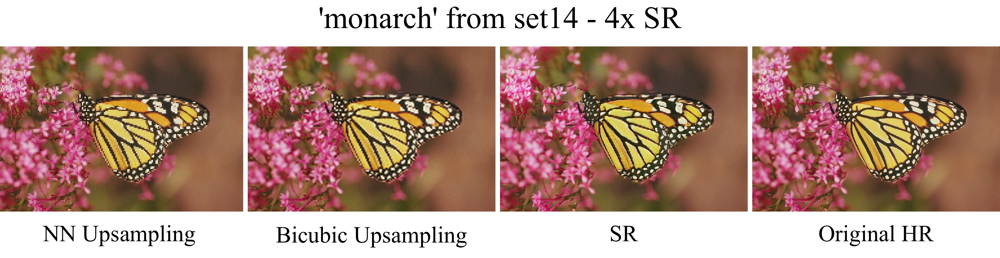
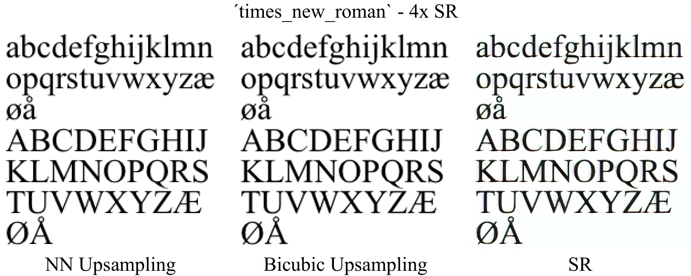

# esrdgan
GAN implementation for single image super resolution - based on ESRGAN, and written by [me](https://github.com/eirikeve), using `python/pytorch`.


Parts of the code in the repository was based on ESRGAN's [source code](https://github.com/xinntao/BasicSR) - this is noted in the respective files.

A 4x SR model was trained on the `Flickr2K` dataset, for 200 000 iterations (batch size 8). Here is a sample of the output - the widely used `monarch` image:



Here is another sample - an image I made, `times_new_roman`, which has no HR counterpart:



You can find more outputs in the [`output`](output/) folder.
There are also some sample inputs in the [`input`](input/) folder.


The performance of the model is not as good as SOTA implementations, and there are a few key reasons I believe caused this:  
1) The model was not pretrained for PSNR (which is quite common to do)
2) The model was trained for fewer iterations than most SOTA implementations (200k iterations of batch size 8 vs. ESRGAN's ~500k iterations of batch size 16, after PSNR-oriented pretraining)
3) The model was more shallow than SOTA implementations, the reason being limited computing resources  
4) Only `Flickr2K` was used for training - having more data would be beneficial.

## Installation & howto


### Getting started

To run the project, you'll need:  
```bash
python3 # I used 3.6
numpy
torch
torchvision
opencv-python
tensorboardX
progressbar2
```
`CUDA` is also strongly recommended (at least if you're going to do any training).

### Setting up

#### Using the pretrained model
If you're planning on using the pretrained model to upscale LR images, here's what you'll need to do:

```bash
# Clone the github repo
git clone https://github.com/eirikeve/esrdgan
# Add your own images to the input folder
# You can either run it in test mode, or in use mode
# Here I will cover 'use mode'.
cd esrdgan
# Choose some images to upscale. There's already some in the input folder.
cp ~/desktop/my_cool_img.png input/
# Modify the config to match your paths
vim pretrained/config_use.ini
# you'll want to set:
# generator_load_path to whatever $(esrdganDir)/pretrained/ESRDGAN.pth is
# root_path to whatever $(esrdganDir) is
# dataroot_lr of DATASETTEST to whatever $(esrdganDir)/input is
# gpu_id to either nothing, or to whatever GPU you'll be using
# you do not need to modify other parts of the config file.

# upscale images
cd src
python run.py --use
```


#### Training your own model

If you're planning on training your own model, here's most of what you'll need to do:

```bash
# Clone the Github Repo  
git clone https://github.com/eirikeve/esrdgan
cd esrdgan && esrdganDir="$(pwd)"
# Make a directory for your datasets
datasetFolder = ~/Programming/Datasets
# Get a training dataset
# I used this one - Flickr2K from https://github.com/limbee/NTIRE2017
mkdir -p $datasetFolder/; cd $datasetFolder/
wget https://cv.snu.ac.kr/research/EDSR/Flickr2K.tar
tar -xvf Flickr2K.tar
# You'll only need HR images, as these can be further cropped, and  downsampled to LR images during runtime. 
# I converted the training dataset into a large amount of 256x256 crops using this script from ESRGAN's source - reducing the time it takes to load each image a bit.
curl https://raw.githubusercontent.com/xinntao/BasicSR/master/codes/scripts/extract_subimgs_single.py > extract_subimgs_single.py
# Modify the script to match the paths to your dataset, and run it
vim extract_subimgs_single.py
python extract_subimgs_single.py

# Get a validation dataset
# I used BSDS100 which you can find here
curl http://vllab.ucmerced.edu/wlai24/LapSRN/results/SR_testing_datasets.zip > testing_datasets.zip
unzip testing_datasets.zip
# again, you'll only need the HR images, as these can be downdampled during runtime

# now, modify the config file to suit your needs
# you'll need to specify your dataset folder, for instance.
cd $esrdganDir
vim src/config/ESRDGAN_config.ini

# then, begin training. .pth models are stored under $(esrdganDir)/runs
cd src
python run.py --train --cfg config/ESRDGAN_config.ini
# if you stop training, you can resume it later on. 
^C
# in the $(esrdganDir)/runs dir, you'll find a folder for this run 
# in there, you'll find a config file.
# modify the config file to load the G_<it>.pth, D_<it>.pth, and state_<it>.pth files
# you also need to set load_model_from_save = True and resume_training_from_save = True
cd $(esrdganDir)/src
vim ../runs/<name_of_run>/config.ini
# Then, resume the training
python run.py --train --cfg ../runs/<name_of_run>/config.ini
```

#### Testing a model 
If you're planning on testing the performance of your model on a set of LR + HR images, here's what you'll need to do.

Note that there's also a `config_test.ini` supplied - this is for testing the pretrained model. You can use that one instead if you'd like - but you'll need to modify the paths there as well.

```bash
# first, have a trained G

vim runs/<your_run>/config.ini
# you'll want to set:
# generator_load_path to whatever $(esrdganDir)/runs/<your_run>/G_<it#>.pth is
# gpu_id to either nothing, or to whatever GPU you'll be using
# make sure the DATASETTEST mode is hrlr
# specify DATASETTEST dataroot_lr and dataroot_hr
# ensure that the HR images have dimensions that are evenly divisible by 4

# run
cd src
python run.py --test --cfg ../runs/<your_run>/config.ini
```


### Datasets


#### Flickr2k Subcrops

The dataset I used for training can be downloaded from my Drive, [`here`](https://drive.google.com/file/d/1DpGqhuK9v8obQihBqoT40COn-Q0Qp_Xb/view?usp=sharing). It consists of 256 x 256 crops from Flickr2k. You can also download Flickr2k directly,
```bash
wget https://cv.snu.ac.kr/research/EDSR/Flickr2K.tar
tar -xvf Flickr2K.tar
```

For validation, I used BSDS100, and for testing, I used Set14. Both can be found here,
```bash
curl http://vllab.ucmerced.edu/wlai24/LapSRN/results/SR_testing_datasets.zip > testing_datasets.zip
unzip testing_datasets.zip
```

### More info on configuring the model

To run the project, go to the `src` dir and run

```bash
python run.py <args>
```

The available args are,
```bash
--cfg /path/to/config   # defaults to config/ESRDGAN_config.ini
--train                 # do training
--test                  # do testing (basically: Upscale & compute PSNR)
--use                   # just upscale images
```
You have to specify either `--train`, `--test`, or `--run`.

To configuring the model to train, you can make your own `.ini` file. For information on what the fields in the config do - see [`config/ESRDGAN_config.ini`](config/ESRDGAN_config.ini).


## A brief overview

The main motivation behind implementing ESRDGAN from the bottom up instead of just forking ESRGAN's (or another implementation's) source, was that I wanted to really understand how a GAN is structured and implemented. I'm pretty satisfied about the outcome: though it did not result in a SOTA SR implementation, I have learned a lot about GAN's - and perhaps most about how hard they are to train. The bulk of the time I spent working on this project, I was working towards achieving stable training. Additionally, I am rather confident that tweaking the model parameters and training it on a larger dataset for a longer time could give great results. If I have the time, I will do so eventually.


Although this implementation was inspired a lot by ESRGAN, it is different in some areas. For information on this, you can check out the [`project slides`](docs/project-slides.pdf).

### Architecture
Similarly to ESRDGAN, the generator architecture is based around the `Residual in Residual Dense Block (RRDB)` and `UpConv` blocks. It has a `VGG`-like discriminator, and a `VGG-19` feature extractor.

### Loss criterion
`Relativistic` adversarial loss (BCE) is used, and additionally, the generator has a `L1` pixel criterion and a `L1` feature criterion. The feature criterion uses the `VGG-19` feature extractor, taking the output at layer number 34. This is similar to ESRGAN.

### Training tricks
The implementation supports a number of training tricks intended for improving stability when training. Some of these proved very useful - as I initially struggled to achieve stable training, despite having an implementation that was (in theory at least) very similar to ESRGAN. Some of them proved less useful. They can all be configured in the config file.

### Results

The resulting outputs appear a bit similar to oil paintings. Additionally, they have non-neglible artefacts which cause them to not be quite as visually pleasing as they otherwise would be. There is also a bit of color shift occurring for some images. This is one of the reasons I believe the model is not fully converged, and could benefit from prolonged training.

Overall, the images all have lower PSNR than their bicubically upsampled counterparts. Despite this, I would argue that the outputs generally do look better than bicubic upsamples. As has been noted by others, PSNR might not be the best metric for evaluating the "realness" of an image.